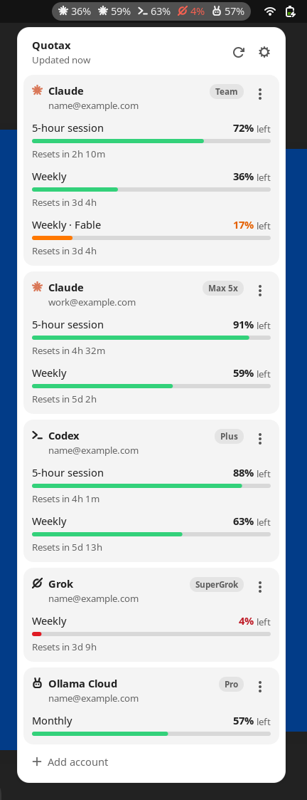

# Quotax

A small GNOME Shell extension that shows how much of your **Claude**, **Codex**, **Grok** and **Ollama Cloud** subscription limits you have left, at a glance, in the top bar.

This is the Linux port of [Quota for macOS](https://github.com/turinglabsorg/quota): same data sources, same account model, same design, rebuilt as a GNOME Shell extension with a small Python backend.

<picture>
  <source media="(prefers-color-scheme: dark)" srcset="docs/screenshots/readme-dark.png">
  
</picture>

## Features

- **Top bar**: one percentage per linked account, showing the tightest account-wide window. Orange under 20%, red at 5% or less.
- **Menu**: every window (5-hour session, weekly, model-scoped weekly, monthly) with a bar and a reset countdown. Long lists scroll.
- **You choose the accounts**: reuse the login of a CLI already on your computer, or sign in to more accounts in the browser. New sign-ins are kept separate from your CLI sessions, so you can monitor several accounts per service.
- **Settings**: show remaining or used percentage.
- **Command line**: `quotax` prints the same data in a terminal.
- **Native and light**: a GNOME Shell extension plus a standard-library Python backend. No Electron, no daemon, no telemetry.
- **Localized**: English and Italian.

## Supported services

| Service | Plans | Windows shown |
| --- | --- | --- |
| Claude (Claude Code login) | Pro, Max, Team | 5-hour session, weekly, weekly per model |
| Codex (ChatGPT login) | Free, Plus, Pro, Business | as reported by Codex (5-hour, weekly or 30-day) |
| Grok (Grok CLI login) | SuperGrok and Grok plans with weekly or monthly credits | weekly credits or monthly budget |
| Ollama Cloud (ollama.com account) | Free, Pro, Max, Team | monthly usage pool (legacy Pro/Max: 5-hour session and weekly), no reset time |

## Requirements

- GNOME Shell 48, 49 or 50 (tested on Ubuntu 26.04, GNOME 50, Wayland)
- Python 3.10 or later (standard library only)
- The CLI of each service you want to link: [`claude`](https://github.com/anthropics/claude-code), [`codex`](https://github.com/openai/codex), `grok`. If the `claude` CLI is missing, Quotax falls back to the Claude Code bundled with the Claude desktop app. Ollama Cloud needs no CLI: sign in from the menu, or link the login of [Ollama](https://ollama.com/download) (`ollama signin`).

## Install

```bash
git clone https://github.com/turinglabsorg/quotax.git
cd quotax
scripts/install.sh
```

Then log out and back in: GNOME Shell on Wayland only discovers new extensions at login. The script copies the extension to `~/.local/share/gnome-shell/extensions/quotax@turinglabs.org`, installs the `quotax` command in `~/.local/bin` and adds the extension to your enabled extensions.

`scripts/install.sh --uninstall` removes both. Linked accounts stay in `~/.config/quotax` and `~/.local/share/quotax` until you delete them.

## Linking accounts

Open the menu and choose **Add account**. For each service you can:

- **Link** the login already used by the CLI on this computer. Quotax reads that session and never changes it.
- **Sign in to another account…**: Quotax runs the official CLI sign-in in an isolated folder and opens the service's own page in your browser. Quotax never sees your password. Repeat it to add as many accounts as you want.

To stop monitoring an account, open its `⋮` menu and choose **Unlink account**. For accounts Quotax signed in, this also signs out and deletes the isolated session.

The same works from a terminal:

```bash
quotax                     # usage for the linked accounts (or the detected CLI logins if none are linked)
quotax detect              # logins found for each CLI
quotax link claude         # link the Claude Code login (also: codex, grok)
quotax signin codex        # sign in to another Codex account in the browser
quotax accounts            # linked accounts and their IDs
quotax unlink <id>         # stop monitoring an account
```

Every command accepts `--json`, which prints one JSON event per line. The extension uses exactly that.

## How it works

| Service | Data source |
| --- | --- |
| Claude | `GET api.anthropic.com/api/oauth/usage` with the Claude Code OAuth token |
| Codex | JSON-RPC `account/rateLimits/read` on `codex app-server`, so Codex refreshes its own token |
| Grok | `GET cli-chat-proxy.grok.com/v1/billing` with the Grok CLI token |
| Ollama Cloud | `GET ollama.com/api/usage` and `POST ollama.com/api/me`, signed with an Ed25519 device key like the Ollama CLI does |

Quotax refreshes every 5 minutes, after resume from suspend, when a window resets and when you open the menu (if the data is more than a minute old). It only talks to the services above.

Tokens of the shared CLI logins are renewed by the official CLIs, never by Quotax. If the Claude Code token has expired because you have not used `claude` in a while, Quotax starts it in the background for a few seconds so it can renew its own session, then retries.

These endpoints are the ones the official CLIs and ollama.com/settings use. They are not public APIs and may change without notice. Ollama reports only how much of each window is used, never when it resets, so Ollama Cloud windows show no countdown.

### Where data lives

- Linked accounts (no secrets): `~/.config/quotax/accounts.json`.
- Accounts signed in through Quotax: `~/.local/share/quotax/accounts/<service>/<id>` (mode 700), including Claude's `.credentials.json`.
- Shared CLI logins stay where each CLI keeps them (`~/.claude`, `~/.codex`, `~/.grok`, `~/.ollama`).
- Ollama Cloud accounts signed in through Quotax are a device key in their isolated folder, linked to your account on ollama.com; unlinking the account also removes the key from ollama.com.
- Display setting: GSettings key `org.gnome.shell.extensions.quotax display-mode`.

## Differences from the macOS app

- Top bar indicator and menu instead of a menu bar item and popover. GNOME has no hover tooltips there, so the menu carries all the detail.
- No "Launch at login" toggle: GNOME loads enabled extensions at login.
- No Keychain: Claude Code on Linux keeps its credentials in `.credentials.json`, so isolated Claude logins live in their own folder.
- CLIs that need a terminal run in a pseudo-terminal from Python instead of `/usr/bin/script`.

## Development

```bash
scripts/test.sh                    # unit tests (parsers, accounts, Italian catalog coverage)
scripts/preview.sh                 # render the menu with sample data in a headless GNOME Shell → build/preview
scripts/preview.sh --live build/live   # same, with your linked accounts and real usage
QUOTAX_DEBUG=1 quotax                # log failed HTTP responses (status and body, never tokens)
```

`scripts/preview.sh` runs a throwaway headless GNOME Shell with a private D-Bus session and temporary XDG directories, so it never touches your session. Regenerate `docs/screenshots` from it (`PREVIEW_LANG=en_US.UTF-8`) after visible UI changes.

The design system lives in [`DESIGN.md`](DESIGN.md); contributor notes for humans and coding agents are in [`AGENTS.md`](AGENTS.md).

### Adding a language

Copy `quotax/locale/it.json` to `quotax/locale/<language>.json` and translate the values. Both the extension and the command line read the same catalog.

## Acknowledgements

The endpoints, headers and account-isolation approach follow [Orca](https://github.com/stablyai/orca) by Stably AI (MIT License), through the macOS version of Quota.

## Disclaimer

Quotax is an independent project and is not affiliated with, endorsed by or sponsored by Anthropic, OpenAI, xAI or Ollama. Claude, Codex, Grok and Ollama are trademarks of their respective owners.

## License

[MIT](LICENSE)
